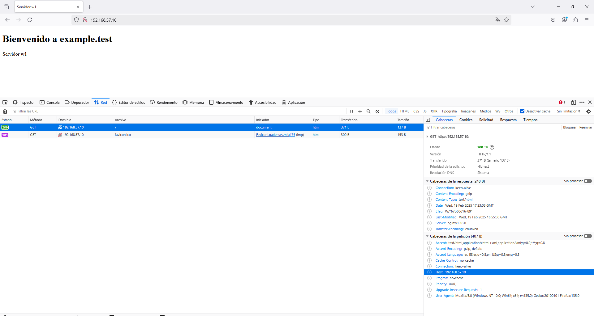

# Proxy Inverso con Nginx y Vagrant

Este proyecto muestra cómo configurar un proxy inverso con Nginx utilizando dos máquinas virtuales Debian gestionadas por Vagrant. El proxy redirige las peticiones a un servidor web backend.

## Arquitectura
La configuración incluye:
1. **Servidor Proxy**: `proxy` (Nginx), dirección `192.168.57.10`.
2. **Servidor Web**: `w1` (Nginx), dirección `192.168.57.11`.

Las peticiones a `http://www.example.test` llegan al proxy, que las redirige al servidor web `w1` en el puerto 8080.

### Diagrama de Red (PlantUML)
```plantuml
@startuml
!define osaPuml https://raw.githubusercontent.com/Crashedmind/PlantUML-opensecurityarchitecture2-icons/master
!include osaPuml/Common.puml
!include osaPuml/User/all.puml
!include osaPuml/Server/all.puml

Usuario: <$osa_user_green_operations> Juan
www: <$osa_server_proxy> Proxy
w1: <$osa_server_web> Web

Usuario -> www
www -> w1
w1 -> www
www -> Usuario
@enduml
```

## Requisitos
- Vagrant
- VirtualBox
- Sistema anfitrión con conexión a red privada

## Despliegue con Vagrant
El `Vagrantfile` configura las dos máquinas virtuales:

## Explicación Detallada

1. **Configuración del Servidor Web (w1)**

- IP: `192.168.57.11`
- Puerto: `8080`
- Página de prueba en `/var/www/html/index.html`.
- Configuración Nginx:
```nginx
server {
    listen 8080;
    server_name w1;
    root /var/www/html;
    index index.html index.htm;

    location / {
        add_header Host w1.example.test;
        try_files $uri $uri/ =404;
    }
}
```

2. **Configuración del Proxy Inverso**

- IP: `192.168.57.10`
- Puerto: `80`
- Reenvío al servidor `w1` en `192.168.57.11:8080`.
```nginx
server {
    listen 80;
    server_name example.test www.example.test;

    location / {
        proxy_pass http://192.168.57.11:8080/;
        add_header X-friend enrique;
    }
}
```

3. **Flujo de Tráfico**

1. El usuario accede a `http://www.example.test`.
2. El proxy (Nginx) en `192.168.57.10` recibe la petición.
3. El proxy redirige la petición a `http://192.168.57.11:8080/` (Servidor w1).
4. `w1` responde con la página HTML.
5. El proxy devuelve la página al navegador del usuario.

## Prueba de Conectividad
1. **Levantar las máquinas:**

```bash
vagrant up
```

2. **Agregar en el anfitrión (`/etc/hosts` o `C:\Windows\System32\drivers\etc\hosts`):**

```
192.168.57.10 www.example.test
```

3. **Acceder desde el navegador:**

```
http://www.example.test
```


4. **Verificar con `curl` desde el proxy:**

```bash
curl http://www.example.test
```


## Comprobaciones y Logs

1. **Acceso y Verificación de Logs**

- Acceder a `http://192.168.57.10` desde el navegador.

- Ver logs en la máquina `proxy`:

```bash
sudo tail /var/log/nginx/access.log
```


- Ver logs en la máquina `web`:

```bash
sudo tail /var/log/nginx/access.log
```


2. **Cabeceras HTTP**

- En Firefox, pulsar `Ctrl+Shift+I` (Herramientas de desarrollo).
- Ir a la pestaña `Network` y marcar `Disable cache`.
- Recargar la página y examinar la petición GET.



Si accedemos mediante un nombre de host `www.192.168.57.10.nip.io`, veremos que la cabecera Host cambia.


### 3. **Comprobación de Cabeceras X-friend y Host**
- El proxy añade la cabecera `X-friend`.
- El servidor web `w1` añade la cabecera `Host`.

Ejemplo de configuración en `/etc/nginx/sites-available/default`:

**En Proxy:**

```nginx
location / {
    proxy_pass http://192.168.57.11:8080;
    add_header X-friend enrique;
}
```


**En Servidor Web (w1):**

```nginx
location / {
    add_header Host w1.example.test;
    try_files $uri $uri/ =404;
}
```


- Reiniciar Nginx:
```bash
sudo systemctl restart nginx
```

- La verificacion del navegador (pestaña `Network`), son las dos capturas anteriores.

## Ampliacion
- Detener las máquinas:
```bash
vagrant halt
```

- Destruir las máquinas:
```bash
vagrant destroy
```


